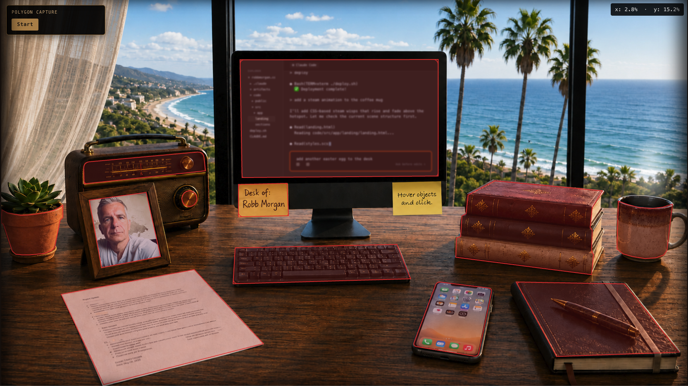

# The Desk

The story of building robbmorgan.com — a cinematic walnut-desk
website that I built with Claude Code as my
pair-programmer over many late nights, many wrong turns, and more iterations
than I'd care to admit.

This document isn't a tutorial. It's a record of the effort. The places where
I knew exactly what I wanted and couldn't say it; the places where the
first try was wrong and we threw it out; the moments where something finally
clicked into place and I sat back and stared at the screen for a while.

If you've ever wondered what it actually takes to build a personal site that
isn't a template, this is the honest answer.

---

## The Vision

I didn't want a portfolio site. There are a thousand of those, and they all
look the same: hero section, three feature tiles, a contact form, a
LinkedIn link. They're competent and forgettable.

I wanted a *scene*. I wanted you to land on the page and feel like you had
walked into a room. There would be a desk — my desk, conceptually — with
things on it. A book stack. A monitor with code on the screen. A radio. A
coffee mug with steam rising from it. A picture frame, a phone, a journal,
a potted plant on the corner. Each thing would mean something. Each would
be clickable. Each would take you somewhere.

The idea was that the desk would *be* the navigation. No menu bar. No
"About" tab. Just a place, rendered cinematically, with the implicit
invitation: *look around*.

That decision drove everything that followed.

---

## The Stack

Angular 21, TypeScript, SCSS. No framework gymnastics — standalone
components, signals for state, lazy-loaded routes for the content
sub-pages. Esbuild via the unified `@angular/build:application` builder.
Vitest for tests. The whole site is static after build and ships via
`pm2 serve --spa` on an Azure Linux App Service. A custom `deploy.sh`
zips the build, idempotently sets the SPA-fallback startup command, and
pushes the zip up.

The choice of Angular was deliberate but unromantic — I work in it daily,
and I wanted to use the new signals primitives in anger on something that
actually mattered to me.

---

## The Desk Scene

The first decision was the art. The desk image is a single PNG —
walnut surface, window behind it with a view of the Southern California
coast, monitor, books, all the objects already in place. I rendered four
variants: morning, mid-day, evening, night. The window's sky color, the
light falling on the desk, the warmth of the sun — everything shifts.

Then came the hard part: making the objects on that flat image
*clickable as individual objects*.

The naive solution would have been rectangular hit zones. But a book
stack isn't a rectangle. A radio isn't a rectangle. The picture frame is
*skewed*. A rectangular hotspot over a skewed picture frame either
overshoots the desk or undershoots the frame, and either way it looks
amateurish.

So every hotspot became a polygon. Each interactive object on the desk
is a `<button>` with a `clip-path` polygon that traces its actual
silhouette. The book stack's polygon walks the outer perimeter of all
three books with a 14-vertex shape. The terracotta plant pot is a
21-vertex shape. The radio uses an SVG path with quadratic Bezier curves
for its rounded top corners.

### The Polygon Capture Tool

This deserves its own section, because the rest of the desk scene
would not have been possible without it. There are eleven hotspots on
the desk. Each one is a custom polygon with anywhere from four to
twenty-one vertices traced around the silhouette of a real object in
the rendered scene. Authoring those by eyeball was a non-starter.

So we built a debugging mode.

Append `?debug=1` to the URL and the entire scene shifts into a
hotspot-authoring environment:

**1. Every hotspot outline is drawn in red.** In production, the
polygons are invisible — you only see them on hover via the brass
outline. In debug mode, every polygon is permanently outlined so you
can see exactly where each click target lives and whether it actually
hugs its object. The first time I turned debug mode on, I discovered
that half of my initial rectangle-approximations were drifting two or
three pixels off their objects. The red outlines made the misalignment
impossible to ignore.

**2. A live coordinate readout in the upper-right corner.** As your
cursor moves over the scene, it shows the current position as `x: NN.N%
· y: NN.N%` in image-percentage units. Hover any pixel on the desk and
you instantly know its coordinate in the same units the polygons use.

**3. A polygon-capture panel in the upper-left.** This is the heart of
the tool. The workflow:

- Click **Start**. The panel asks you to name the polygon (e.g.
  `book-stack`, `radio`, `picture-frame`).
- Click **Begin**. The mode switches to *capturing*. Now every click
  on the scene drops a numbered marker at that point.
- Click around the perimeter of the object you're outlining. Clockwise
  from the top-left, each click adds a vertex. The captured polygon is
  rendered live as a semi-transparent yellow overlay on top of the
  scene, with each vertex marked by a small numbered chip. You can
  see the shape building in real time. Need to undo a vertex? **Undo**
  pops the last point off. Get it wrong entirely? **Cancel** resets.
- When the outline is right, click **Stop**. The panel switches to a
  "done" state and renders a ready-to-paste output block.

**4. The output block.** This was the killer feature. The panel
doesn't just show coordinates — it formats them three ways:

- The image-percentage corner list (for reference).
- A computed bounding box (`left`, `top`, `width`, `height`) in
  image-percentage units, ready to paste into the SCSS file as the
  positioning rule for the hotspot.
- The polygon points expressed as percentages of *that bounding box*,
  ready to paste into the `spots[].polygon` array in `landing.ts`.
- A full CSS `clip-path: polygon(...)` declaration, one vertex per
  line, ready to drop into the SCSS file.

The "Copy" button copies the whole formatted block to the clipboard.
Every new polygon was: capture, copy, paste into SCSS, paste into
landing.ts, refresh, verify the red outline matches the object,
done.

**5. Click-to-edit on existing hotspots.** Click any *existing*
hotspot in debug mode and instead of navigating, an edit panel opens
with two actions:

- **Update** hides the spot for the session and pre-fills the capture
  flow with the spot's key, so you can immediately re-trace it from
  scratch. This is how every refinement happened — open debug mode,
  click the hotspot you want to improve, hit Update, re-capture with
  the cleaner outline, paste the new polygon over the old one in
  the source.
- **Delete** hides the spot for the session (the actual entry in the
  `spots[]` array still needs to be removed from code). Useful for
  visually verifying "what would this scene look like without that
  hotspot."

**6. The session-deleted tracking.** Spots deleted in debug mode go
into a `deletedSpotKeys` set that the `visibleSpots()` computed signal
filters against. The actual readonly `spots[]` array is never mutated
— the deletions are session-only, which means you can experiment
freely without worrying about losing the source-of-truth data.

The full feature lives in `landing.ts` (the `captureState` /
`capturePoints` signals, the `startCapture` / `beginCapturing` /
`stopCapture` flow) and `landing.html` (the `@if (debug())` block
with the capture panel, edit panel, live preview SVG, and numbered
markers). It's tucked away behind a query parameter — production
visitors will never see it — but for me it's been one of the most
important pieces of code in the entire project.

A representative session, after I'd already shipped the site:

> *Robb: "key: notification-area, points: 4 [polygon coordinates] —
> that is the notification polygon and the proper skewing of the
> image — make it so."*

The coordinates came straight from the debug panel. The tool produced
them; my job was just to trace the right shape. Twenty seconds of
debug-mode work replaced an hour of eyeballing and reverse-engineering
CSS values.

It probably saved me twenty hours over the project. The hotspot
system as it exists today simply wouldn't have been buildable without
it.

### The Outline Glow

Hover over any hotspot and a warm brass-colored outline traces the
object's exact shape with a soft outer glow. Getting that right took
longer than it should have. The trick was that the outline cannot be a
child of the hotspot button — the button has `clip-path` applied, and
anything inside it gets clipped too, which means the outer glow would
be clipped right at the polygon boundary. The glow has to live
*outside* the clip-path.

The solution was a sibling structure: every polygon hotspot has a
matching SVG element rendered as a sibling, not a child. Both share the
same bounding box and the same polygon coordinates. The button receives
clicks; the SVG draws the stroke and glow. On hover, the SVG fades up.

This is the kind of thing that takes ten minutes to design correctly
and forty minutes if you guess.

---

## Time of Day

Once the four scene variants existed, the question was how to switch
between them. I wanted the site to automatically reflect the visitor's
local time — if you visit at 6 PM, you see the evening scene. If you
visit at 11 PM, you see the night scene.

The rules:

- 05:00–10:00 → morning
- 10:00–17:00 → afternoon
- 17:00–21:00 → evening
- 21:00–05:00 → night

This part was easy. A `signal<TimeOfDay>` initialized from
`new Date().getHours()`, and a `setInterval` that re-checks every 60
seconds so a long session crosses the boundary cleanly.

But I also wanted the visitor to be able to *preview* the other times.
The keyboard is a hotspot that opens a time-of-day picker overlay.
Click Morning, Afternoon, Evening,
or Night, and the scene swaps. Close the picker and it goes back to
local time. On mobile, where the picker overlay doesn't fit
ergonomically, tapping the strip cycles through the four variants.

### The Crossfade

A naive scene swap would just change the `src` of the desk ``. But
the browser would blink-cut to the new image: hard, ugly, instantly
breaks the spell. I wanted a soft crossfade.

The solution was two stacked `` elements, both absolutely
positioned. The active one is at opacity 1; the inactive one preloads
the next scene's PNG. When the new image's `(load)` event fires, the
inactive slot becomes active — opacity 1 — and the previously-active
slot fades to 0. The CSS transition handles the visual blend.

This sounds simple. It hid a subtle bug.

### The Bug Where the Desk Disappeared

When you click on an object on the desk, the site navigates to a content
page (Resume, Novels, whatever). Angular destroys the Landing component.
When you click the home link to return to the desk, it remounts.

After this round-trip, sometimes the desk wouldn't show up. The scene
area would be black, the dynamic elements (birds, notification, coffee
steam) would be rendering on top of nothing, and the actual desk PNG
would be invisible.

The cause was the inactive slot's seed image. To avoid having to
special-case the very first load, I'd seeded the inactive slot with a
1×1 transparent GIF data URL. The browser loads that data URL instantly
— it fires `(load)` the moment the element mounts. The `onSlotLoad`
handler dutifully promoted that slot to active, hiding the real desk
image that was still loading in the other slot.

The fix was a guard: only promote a slot to active if its current `src`
actually matches the target `sceneSrc()`. The blank GIF doesn't match,
so it doesn't steal active.

I spent the better part of an evening on this. The symptom — the desk
sometimes goes black on return — was annoyingly intermittent and only
happened on the return trip, never on the first load. Once I understood
what was happening I felt foolish, but that's how it always goes.

---

## The Birds

This is the longest story in the project. I want to tell it properly.

### Pass 1: One Bird, Lots of Glitches

The original brief: birds should occasionally fly across the sky behind
the desk, right to left. I found an animated GIF of a stylized
silhouetted bird with wings flapping and dropped it on the scene. It
worked, in the sense that it appeared and translated across.

It looked terrible.

Problem one: the GIF had a solid white background. The first attempt to
chroma-key it out left awful fringing around the wing edges.

Problem two: the GIF had a watermark in the corner — a tiny
illegible artist credit. I tried to crop it out, but the wing tips
extended into the cropped region and got chopped on every frame.

Problem three: the wing animation looped, and the loop point was
visible — at the seam, the wings jolted backwards for a single frame
because the last frame and the first frame weren't perfectly aligned.

### Pass 2: The Python Pipeline

Each of those problems wanted a different tool, so I built a Python
pipeline using PIL and NumPy:

1. **Background removal via edge flood-fill.** For each frame, start a
   flood-fill from the canvas edges using the white background color.
   Anything reachable from an edge gets made transparent. Anything
   unreachable — the bird, surrounded by transparent — survives. This
   correctly handled the wing tips that the chroma-key was eating.

2. **Largest-connected-component extraction.** After flood-fill, the
   watermark was still there as an isolated pixel cluster. Take the
   largest connected component of remaining opaque pixels and discard
   everything else. The bird is one connected shape; the watermark is
   a separate one. Bye, watermark.

3. **Color normalization.** Any remaining white or pale-gray pixels
   along the wing edges got darkened to a uniform `#a9a9a9`. This
   eliminated the residual halo and gave the bird a consistent
   silhouette across all 14 frames.

4. **Frame ordering for the loop seam.** The original GIF's frame order
   was the source of the wing-jolt. By rotating the frame list so the
   last frame leads cleanly into the first, the seam disappeared. The
   wings now beat in a continuous loop.

The output was an animated WebP at ~90 KB, transparent background, no
watermark, no glitch. This took me two evenings.

### Pass 3: Companions

One bird looked lonely. I wanted a small formation — two or three birds
flying together, but not so close that they read as a single shape.

I generated `bird2.webp` and `bird3.webp` from the same source frames,
but with the frame list rotated by 3 and by 7 positions respectively.
That meant when the leader's wings were down, the first companion's
were mid-flap and the second companion's were up. Total wing
desynchronization across the formation. From the viewer's perspective,
the birds look like individual creatures, not three copies of one.

This is the kind of detail nobody will consciously notice. But if it
were *missing* — if all three birds beat their wings in perfect sync —
people would feel that it looked wrong without being able to articulate
why.

### Pass 4: Position Randomization

Now the formation always started in the same spot on the right edge of
the scene and flew the same path. After three or four flights you
noticed the repetition.

The fix was per-flight randomization. For each bird that's about to
fly, generate a random start position within `x ∈ [101, 110]cqw`
(off-screen right, in container-query units so the math scales with
the scene size) and `y ∈ [30, 40]cqh` (the upper third of the sky).
Enforce a minimum vertical separation of `2.5cqh` between any two
birds so they don't visually overlap.

CSS keyframes can't read JavaScript variables directly, but they *can*
read CSS custom properties. So the component sets `--start-x` and
`--start-y` as inline styles on each bird element. The keyframe
`from`-clause reads `var(--start-x)` / `var(--start-y)`. New
randomization per flight, no recompile, no animation restart trickery.

### Pass 5: Production Cadence

The final tuning: how often do the birds fly, and how many?

- **First flight (page load):** all three birds, full formation.
- **Subsequent flights (30–120 second random delay):** a random subset
  of 1, 2, or 3 birds, each with a randomized non-overlapping start
  position.

The asymmetry is deliberate. The first flight establishes that birds
are part of this world. Subsequent flights are surprises — sometimes a
lone straggler, sometimes a pair, occasionally another full formation.

### Pass 6: The Visible-Sky Clip Mask

The birds fly across the *entire* width of the scene. But the sky
isn't a continuous strip — the monitor, the curtain, the palm tree
trunks, and the window frames all block parts of it. A bird that
floated *through* the monitor would look like a hallucination.

The solution was an SVG `<clipPath>` with five disjoint polygons —
one for each visible piece of exterior sky. The bird-flight `
`
applies `clip-path: url(#bird-flight-mask)` so the birds get clipped
to those polygons. When a bird's path crosses behind the monitor, it
naturally disappears at the monitor's edge and reappears on the other
side. No bird logic involved; the clip-path handles it.

I captured those five polygons by hand in the debug mode polygon-capture
tool. Each one took a careful trace of one piece of visible sky.

### Pass 7: Persistence Across Navigation

The Landing component is destroyed when you navigate to a content page.
The birds — mid-flight, just animation — would restart from the right
edge when you came back. That broke the illusion.

I built a service (`DeskStateService`, `providedIn: 'root'`) that
outlives the component. It records `flightStartedAt` (wall-clock
timestamp when the current flight began) and `nextFlightAt` (wall-clock
timestamp when the next flight is scheduled).

On component remount, the constructor reads those values. If a flight
is in progress, the new bird elements receive a negative
`animation-delay` equal to the elapsed time — CSS picks up the
animation at exactly the position the bird was at when you left. If
the inter-flight wait is in progress, the next flight is scheduled for
the remaining time, not restarted from scratch.

The result is that you can click into the Resume page, read for ten
seconds, click back to the desk, and the birds are exactly where they
would have been if you'd never left.

---

## The Monitor

The monitor on the desk needed to feel alive. A static image would have
been fine, but a static image is *visibly* static, and that breaks the
trick.

I wanted it to look like a real coding session was happening — VS
Code-style, with a file tree on the left, a chat pane on the right,
the orange-bordered Claude Code input box at the bottom, code
streaming in via a typewriter effect.

### The VS Code Lookalike

The monitor overlay is a `
` clipped to the
exact polygon of the monitor screen. Inside it: a sidebar with a fake
file tree, a tabbed main pane with a chat area, and the input box.
Everything is styled to evoke VS Code — the activity bar gray, the
sidebar slightly darker than the main pane, the orange border on the
input box that Claude Code uses to call out the prompt area.

The whole thing is blurred by 1.6 pixels via CSS `filter: blur()`. You
can read the *structure* — these are file rows, this is a chat
session, this is an input box — but you can't read the specific text.
The blur sells the realism: a real monitor at that resolution wouldn't
be pin-sharp.

### The Typewriter

A `<pre>` element inside the chat area receives one character per 65
milliseconds. The character source is a hardcoded string — a fake
Claude Code session showing me asking for a steam animation, getting
it built, deploying, asking for it to be "billowier," and so on. The
loop point at the end of the string is engineered so that when the
cursor wraps to position 0, the seam reads as a fresh user prompt.

The buffer is trimmed to the last 3000 characters so the `<pre>`
doesn't grow without bound. A bottom-anchored flex layout in the chat
pane auto-scrolls older content off the top — newest line is always
visible at the bottom.

A small CSS blink animation provides the cursor at the end.

### State Persistence Again

When you navigate away and come back, the typewriter doesn't restart
from the beginning. The same service that handles the birds also
records `codeBuffer` (the current rendered string) and `codeCursor`
(the next character to type). On remount, the component reads these
values and resumes mid-stream.

This is the kind of detail that nobody will notice consciously. But if
you navigated to Resume, came back, and the typewriter was empty
again? You'd feel that it had reset. You wouldn't know *why* it felt
fake, but you'd feel it.

### The Security Pass

The monitor text references file paths from this repo (`landing.html`,
`styles.scss`, the deploy script). None of that is sensitive — those
filenames are public, the deployment process is documented in the
project's own CLAUDE.md, and nothing in the text is a credential or
secret.

But you could drag-select from outside the monitor through it and
copy the text via keyboard. I didn't love that. So `.monitor-code`
got `user-select: none` (plus the `-webkit-` prefix). The text is now
decorative-only: you can see it, you can't select it, you can't copy
it, you can't right-click it.

---

## Coffee Steam

The coffee mug sits on the right side of the desk, near the stacked books.
The mug image already had a faint suggestion of warmth, but I wanted
visible steam rising from it.

Eight `` elements, absolutely positioned above the
mug. Each one has the same animation — a `puff-rise` keyframe that
translates upward, scales horizontally outward (the "billow"), and
fades to zero opacity. Each `` has a different negative
`animation-delay` so they're spread across one full animation cycle.
The result is a continuous column of steam: at any moment, a puff is
forming, several are rising at various heights, and one is fading out
at the top.

The first version's puffs went straight up like a thin chimney. I
asked: *can it look billowier?* The answer was to increase the
`scale-X` growth in the keyframe and add a small horizontal drift to
each puff. The column now genuinely billows outward as it rises —
each puff bulges sideways before fading. Much more like real steam.

`pointer-events: none` on the steam container is critical. Without
it, the steam would block clicks on the underlying mug hotspot.

---

## The Phone

This is the second-longest story in the project, and it's mostly an
image-processing one.

The desk has an iPhone on it. The phone has a screen. Periodically, a
notification slides in across the top of the screen — a fake "New
Message" banner. The challenge was making that banner look like it was
*on* the phone, not floating above it.

The phone in the desk render is slightly tilted. The screen is a
parallelogram, not a rectangle. A flat rectangular notification image
placed on top of it would look like a sticker.

### Pass 1: Perspective Warp

I authored a notification image at 520×130 pixels — a flat banner with
the iOS green-bubble look. Then a Python script using PIL's perspective
transform mapped the four corners of that flat image onto the four
corners of the screen's parallelogram. The result was a properly
foreshortened banner that looked like it was *on* the screen surface.

The first try had black corners where the warp pulled the image away
from the canvas edges. The black corners screamed "fake." Filling
them with a cream color from the banner background fixed that.

### Pass 2: The Dark-Pixel Disaster

Then I tried to make the corner-fill transparent instead of cream so
the screen would show through. That seemed like a more elegant
solution.

It was a disaster. The bicubic resampling at the boundary between
"cream-colored banner" and "fully transparent" averaged the two, which
meant the banner's interior near the edges picked up the transparency
as a gradient. The colors looked washed-out and ghostly. Worse: when
I tried to flood-fill out the dark border pixels, my flood-fill caught
*all* dark pixels — including the text and icon inside the banner. The
text turned cream-colored on a cream background. The notification was
illegible.

### Pass 3: Edge-Only Flood-Fill

The fix was a BFS flood-fill that *only* starts from the canvas edges.
Pixels reachable from an edge (the unwanted dark border) get replaced
with cream. Pixels surrounded by cream (the interior text and icon)
are unreachable from any edge and survive untouched. This is the same
technique I used for the bird-background removal. It worked here too.

### Pass 4: Rounded Corners

The first warped version had hard corners that didn't match the
phone's screen radius. I added a 14-pixel corner radius via an alpha
mask applied at the very end of the pipeline — after the warp, after
the flood-fill, after the color normalization. Rounded source corners,
rounded by way of a mask, transparent outside.

### Pass 5: Softening

The notification colors were *too* vivid against the phone screen — the
banner felt like it was bleeding through. I dropped brightness to
0.86, contrast to 0.82, and saturation to 0.70 using PIL's
`ImageEnhance` (RGB only, alpha channel preserved). The banner now
sits on the screen like a real notification, slightly muted but
clearly legible.

The whole notification pipeline is one Python script I keep at
`/tmp/warp_notification.py`. I tweaked it half a dozen times. Each
tweak meant re-running the script, copying the output into
`code/public/`, bumping a cache-buster query string in the HTML, and
checking on the page. The cache-buster query string is now at `?v=16`.
That number is, roughly, the number of times we got it wrong before
getting it right.

### The Notification Timer

The fake notification slides in at random intervals — first one 15-30
seconds after page load, then every 120-360 seconds thereafter. A
quiet message-arrival buzz plays when it appears (autoplay-blocked on
the very first fire if the user hasn't interacted with the page yet,
which is fine).

The timer's wall-clock target is persisted in the same DeskStateService
that handles birds and the typewriter. If you click into a content
page mid-countdown and come back, the notification timer doesn't
restart from the 15-30 second "first" delay — it picks up where it
left off.

---

## The Loading Veil

Here's a problem I didn't see coming.

When you navigate from a content page back to the desk, Angular
remounts the Landing component. The desk PNG is in cache, so it loads
fast — but not instantly. The dynamic elements (birds, monitor code
typewriter, notification image, coffee steam, hotspots) mount and
start animating immediately. For a brief moment — maybe 50ms,
sometimes more on a cold cache — you'd see those dynamic elements
animating against a *black background* before the desk PNG painted.

Birds flying through nothing. A blurred VS Code overlay floating in
void. It looked broken for that single beat.

The fix was a "veil" — an opaque `
` matching the page background
color, layered above all the dynamic content but below the inset-shadow
pseudo-element. The veil is visible while the desk image loads. Once
the *real* desk image fires its `(load)` event (gated on the loaded
slot's `src` actually matching `sceneSrc()`, to prevent the blank
data-URL seed from prematurely flipping it), the veil fades to opacity
0 over 600 milliseconds. Everything is revealed at once — the desk PNG
plus all the dynamic elements that have been quietly mounting
underneath.

The user-facing effect: you click "home," there's a brief dark hold,
then the whole scene fades in cleanly. No more flash of disconnected
dynamic elements against a black background.

This is one of those changes that takes thirty lines of code and
takes the perceived quality of the site from "polished" to "feels
like a real production."

---

## The Three-Tier Color Palette

This was the most back-and-forth chapter of the whole project, and the
final result is the most invisible.

The content pages — Resume, Novels, Code, etc. — needed a typographic
palette that worked across all of them. Cream background, walnut text,
warm accents. I started with `--parchment` as the page background and
moved on.

Then I realized the title cards (the sticky page header that minimizes
on scroll) and the content cards (the individual novel covers, music
albums, etc.) were all the same parchment color as the page
background. There was no visual hierarchy. The cards blended into the
page.

What followed was a multi-day negotiation about exactly how dark each
shade should be.

> *Robb: "we need to lighten the colors for the background and the
> title cards on all the content pages."*
>
> Done. Brightened both.
>
> *Robb: "the title cards can be a little more darker - it's blending
> into the background too much"*
>
> Made them slightly darker.
>
> *Robb: "more! it doesn't look like it changed much"*
>
> Darker still.
>
> *Robb: "way too much! anything in between?"*
>
> Backed off to a midpoint.
>
> *Robb: "now let's separate the title cards from cards within the
> content area. they should be lighter than the title cards."*
>
> Three tiers now — page background, content cards, title cards.
>
> *Robb: "the cards on the pages should be half way between the title
> cards and the page background"*
>
> Computed a literal arithmetic midpoint between the two hex colors.
>
> *Robb: "the novel (content) card should be half way between the
> title and background colors. THEY ARE NOT! and this needs to be
> applied to ALL content pages"*
>
> Audited every section page and fixed the ones that were still using
> the old token.

The final palette, frozen as CSS variables in `styles.scss`:

| Token | Use | Hex |
| --- | --- | --- |
| `--parchment` | Page background (lightest) | `#f8efd8` |
| `--parchment-card` | Content cards inside a page (midpoint) | `#ece1c4` |
| `--parchment-soft` | Title cards + inactive pill buttons (darkest) | `#e0d3b0` |

The midpoint isn't aesthetic; it's *arithmetic*. Average each RGB
channel of the lightest and darkest tokens and you get the midpoint
exactly. The eye reads the hierarchy: darkest = sticky title, mid =
content card, lightest = page background. It's the kind of small thing
that makes the page feel composed.

I lost more hours on this color negotiation than on most of the
animation work. There's no algorithm for "is this dark enough yet."
You just have to look at it and decide. And then your collaborator
disagrees, and you adjust, and they disagree again. Eventually you
land somewhere that feels right to both of you.

---

## The Photo Gallery

The "Take a Break" coffee mug on the desk routes to a photo gallery —
Southern California coastline. The original gallery had a mix of
photos from various locations that didn't all fit the visual brief.

I asked for 25 photos of the SoCal coast, all in 3:2 landscape format
matching the viewer dimensions. Some of the existing photos (numbers
2, 4, 8, 11-15, 19) already fit; we kept those nine and replaced the
rest.

The new set was sourced from Unsplash — Laguna Beach, Malibu, the
cliffs in between. Each photo carries the photographer's name and
their Unsplash username for credit, with the gallery rendering links
to their profiles.

Curating the new sixteen photos took several rounds. The first
sub-agent dispatch I made for this came back with a 529 Overloaded
error from Anthropic's API. I dispatched it again. Same error. So I
just did it directly — parallel `WebFetch` calls to search Unsplash
for landscape coast photos, parallel `curl` downloads, manually
checking each for the right aspect ratio and visual fit. Sometimes
the tools fail and you do the work the slow way.

---

## The Things You Don't See

These are the touches that don't have stories of their own but
deserve mention.

- **Inset drop shadows** on the left and right edges of the scene
  falling *inward* toward the desk. Pseudo-element rather than a
  box-shadow on `.scene` itself because the scene image fills the
  container at full opacity and would paint over a plain inset
  shadow. Small detail, real depth.

- **The mobile-apps hotspot** is a four-sided polygon with rounded
  corners drawn as quadratic Beziers in SVG path notation, mimicking
  the corner radius of an iPhone. The other rectangular-ish hotspots
  use straight polygons because their objects have sharp corners.

- **The radio's audio toggle** plays Bach (the JSB ambient track) via
  a service that persists playback state to `sessionStorage`. Click
  the radio, music starts; navigate away, navigate back, music keeps
  playing. The radio face also has a soft brass-colored glow that
  pulses while the audio is playing — clipped to the captured
  parallelogram of the radio's face panel.

- **The picture frame** on the desk has a portrait of me, masked to
  the frame's actual skewed polygon shape. The portrait has time-of-day
  variants that subtly shift to match the scene lighting — slightly
  cooler in evening, much darker in night.

- **The sticky page header** on every content page uses a
  `min-height: calc(100dvh + 20rem)` rule on the SectionShell wrapper.
  Without it, short pages would oscillate between minimized and
  expanded as the header shrunk the document height, then expanded
  back, then shrunk again. There's also a global
  `* { overflow-anchor: none }` rule that prevents Chrome and Edge
  from stuttering the sticky header. Both rules look like nonsense
  out of context. Both are load-bearing.

- **The mobile fallback** swaps the whole desk scene for a tap-to-cycle
  scene strip and a vertical link list. The cinematic version doesn't
  work below 760px — the polygons depend on the wide aspect ratio.

- **The scene fade behavior** is asymmetric: there is no fade-IN when
  you arrive at the desk view. The scene shows hard. The fade-OUT
  happens only when you click an object to navigate away. The
  `.opening` class is added just before `router.navigateByUrl()`
  fires, and a CSS rule transitions the scene's opacity to 0 over
  the duration of the route change. Fade-in on every arrival would
  add latency without adding meaning; fade-out on departure
  punctuates the transition.

---

## The Process

I lost count of how many times we deployed. The deploy script
(`deploy.sh`) takes about 75 seconds end-to-end — build, zip, upload,
restart. I'd guess fifty deploys, maybe sixty. Every color tweak,
every polygon adjustment, every bird-timing change rode out to Azure
through that script.

I lost count of the iterations on the bird animation alone — at least
seven distinct passes, each one fixing something the previous pass
hadn't fully solved.

I lost count of the times I described what I wanted in three different
ways before the implementation finally matched the picture in my head.
"More billowy." "Darker — but not THIS dark." "It needs to look like
the screen is bleeding through, but not THIS much bleeding through."
There's no shared vocabulary for the difference between *not enough*
and *too much*. You just have to keep refining until both of you nod.

I lost count of the hours.

What I haven't lost count of is the number of times I sat back, looked
at the scene, and saw it just *work* — the birds arcing past behind
the monitor, the steam billowing over the mug, the keyboard ticking
out fake code, the notification fading in and out on the phone, and the
window beyond the desk showing the right time of day for whatever
moment I happened to be looking. Every one of those moments was paid
for in hours of struggle. Every one was worth it.

---

## What I Learned

A few things I'd say to anyone starting their own version of this:

**Pick something stupid and make it work.** A walnut-desk scene with
polygonal hotspots is not a sensible website. A LinkedIn-style
template would have taken me an afternoon. This took weeks of evenings.
The reason to do it is that the result is *yours* — nobody else has
this site. Nobody else can have this site. That's worth a lot.

**Working with a coding agent is a skill.** Claude can write a polygon
clip-path in seconds. It cannot read your mind about whether you want
the inset shadow at `-8px` or `-12px`. You will spend much of your
time learning how to describe what you want in language that converts
into pixels you like. This is a real skill and it gets better with
practice.

**The struggle is the work.** Most of this document is about things
that didn't work the first time. The bird wing jolting. The desk
disappearing on return navigation. The notification's faded colors.
The color hierarchy negotiation that took five separate rounds. None
of those are bugs in retrospect — they are the work. The polished
output is just the final frame of a long sequence of refinements.

**Invest in the debug tools early.** The polygon-capture panel paid
for itself ten times over. The same goes for the persistent state
service — building it once meant I never had to think again about how
to keep dynamic elements smooth across navigation.

**Notice the things nobody will notice.** The wing-frame rotation
that desynchronizes the birds. The arithmetic midpoint of the parchment
colors. The negative `animation-delay` that resumes a flight
mid-stream. None of these will get a compliment from a visitor — but
their absence would have been felt. The art is the sum of details
nobody points out.

---

## Tools

For the record, the tools that built this site:

- **Angular 21** + TypeScript 5.9, SCSS, signals, standalone components
- **Vitest** for unit tests
- **PIL** + NumPy for the image-processing pipelines (birds, notification)
- **Claude Code** as the pair-programmer
- **Azure App Service** + `pm2 serve --spa` for hosting
- A custom `deploy.sh` for one-command pushes
- **Unsplash** for the photo gallery

And one walnut desk, conceptually.

---

If you read this far, thank you. Click everything.
